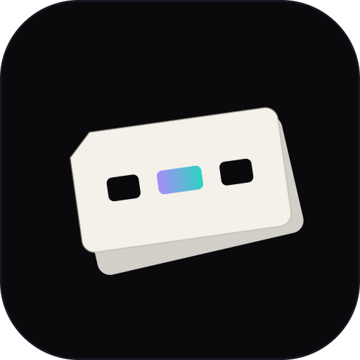

# TemplateIT

<p align="center">
  
</p>

**Local desktop app for prompt templates.** Save reusable chatbot prompts, fill slot markers in a clean UI, copy the result, and keep fill history — without ever mutating the master template.


## Why

Long system prompts often need a few variables (role, task, code snippet, constraints). Copy-paste hunting is slow and error-prone. **TemplateIT** turns markers into fields, previews the filled prompt, and versions each fill locally.

## Features

- **Templates** — title + body, stored as local JSON
- **Custom slot style** — default `<<<{label}>>>`; custom open/close per template (one style per template)
- **Insert slot** — retractable control to place markers while editing
- **Fill session** — slot rail + multi-line compose for large pastes + prompt canvas
- **Copy** — one click to clipboard for any chatbot
- **History** — save versions with optional commit message; delete individual versions; template body stays intact
- **Library** — rename, pin to home, archive, delete
- **Home** — centered empty state + pinned template cards
- **Offline** — no accounts, no cloud, no LLM API
- **Premium UI** — Ethereal Glass treatment + Phosphor Light icons + branded assets

## Quick start (development)

```bash
npm install
npm approve-scripts electron   # once if the Electron binary is missing
npm start
```

```bash
npm test              # domain + structure tests
npm run smoke:main    # headless entry/store smoke
npm run icons         # regenerate build/icon.png from src/assets
```

## Build installers

```bash
npm run build         # icons + test + package → dist/
npm run build:win     # Windows NSIS installer + portable
npm run build:dir     # unpacked app only (fast)
```

Artifacts use the product name **TemplateIT** and the icon from `src/assets/templateit-icon.svg` (rasterized to `build/icon.png`).

See [docs/BUILD.md](docs/BUILD.md).

## Slot syntax

Default (and recommended):

```text
You are <<<{role}>>>.
Review this: <<<{code}>>>
Focus on: <<<{focus}>>>
```

| Rule | Detail |
|------|--------|
| Default form | `<<<{label}>>>` |
| Custom form | Any open/close pair set on the template (saved) |
| One style | Each template uses a single delimiter style |
| Shared labels | One input fills every occurrence of that label |
| Missing values | Empty string in the final text |

Full walkthrough: [docs/USAGE.md](docs/USAGE.md).

## Project layout

```text
electron/              Main process + preload (IPC)
src/domain/            Parse, fill, history, JSON store (unit-tested)
src/renderer/          Modular UI (app entry + surface modules)
src/assets/            Brand icon + wordmark (SVG)
build/                 Generated icon.png for packaging (from assets)
docs/                  Spec, usage, build notes
tests/                 Domain + UI structure tests
scripts/               smoke-main, generate-icons
```

### Renderer modules

| File | Role |
|------|------|
| `app.js` | Boot + event wiring only |
| `state.js` | Session state + action registry |
| `library.js` / `home.js` | Sidebar + home/pinned |
| `editor.js` / `slots.js` | Edit + insert slot |
| `fill.js` / `history-view.js` | Fill session + versions |
| `dom.js` / `modal.js` / `format.js` | Shared UI helpers |

## Architecture (short)

- **Domain** is pure JS — parse/fill/history/store work without Electron.
- **Main** owns `userData` paths, IPC (CRUD + clipboard), and window icon.
- **Renderer** talks only through `window.templateit` (preload bridge).

Design: [docs/superpowers/specs/2026-08-08-templateit-design.md](docs/superpowers/specs/2026-08-08-templateit-design.md).

## Brand assets

| Asset | Path |
|-------|------|
| App icon (SVG source) | [`src/assets/templateit-icon.svg`](src/assets/templateit-icon.svg) |
| Wordmark (SVG) | [`src/assets/templateit-wordmark.svg`](src/assets/templateit-wordmark.svg) |
| Packaged icon | `build/icon.png` (generated via `npm run icons`) |

## Data

```text
{userData}/templateit/templates.json
{userData}/templateit/history.json
```

Override for dev/tests:

```powershell
$env:TEMPLATEIT_DATA_DIR = "C:\path\to\data"
npm start
```

## Scripts

| Script | Purpose |
|--------|---------|
| `npm start` | Run Electron in dev |
| `npm test` | Domain + UI structure tests |
| `npm run smoke:main` | Headless entry/store smoke |
| `npm run icons` | Rasterize SVG assets → `build/icon.png` |
| `npm run build` | Icons + test + full package |
| `npm run build:win` | Windows installer + portable |
| `npm run build:dir` | Unpacked directory only |

## License

[MIT](LICENSE) © TemplateIT contributors
